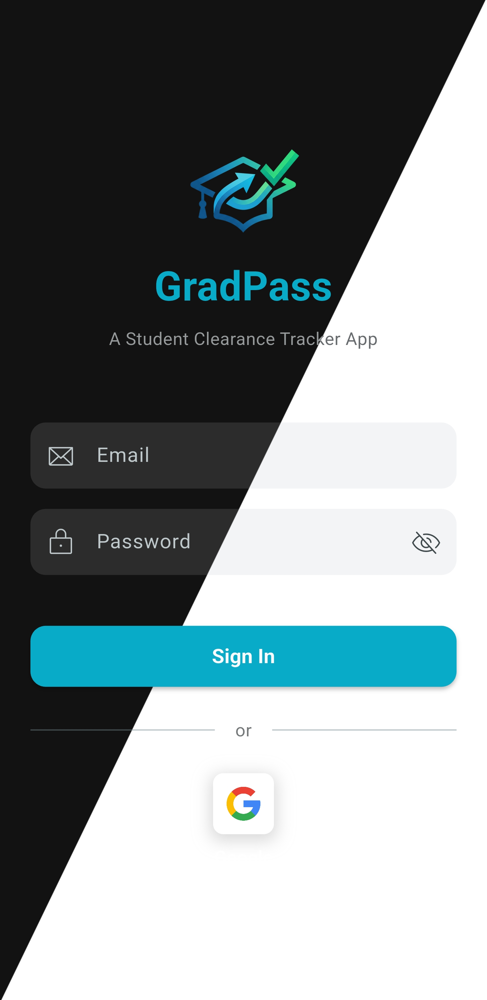
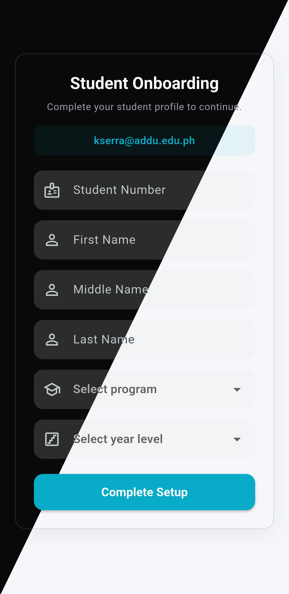
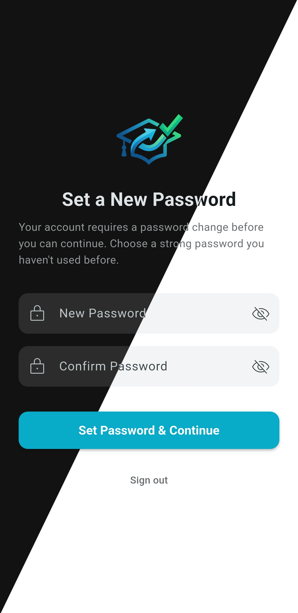
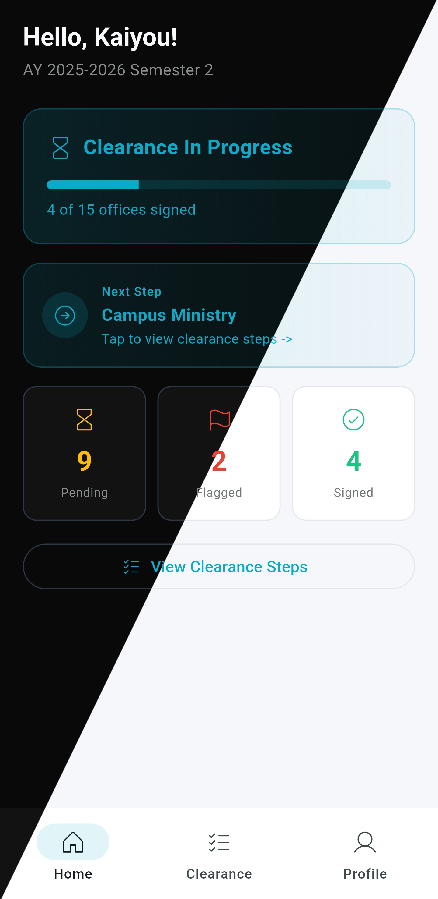
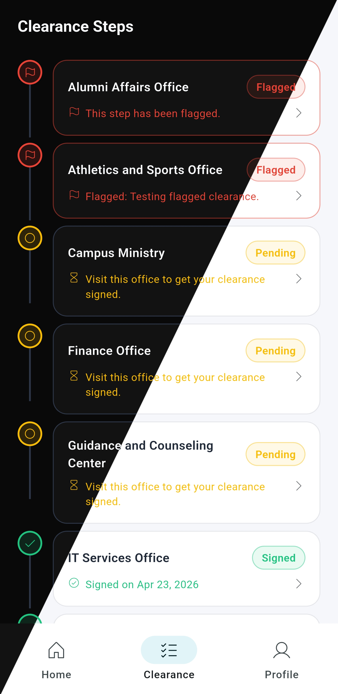
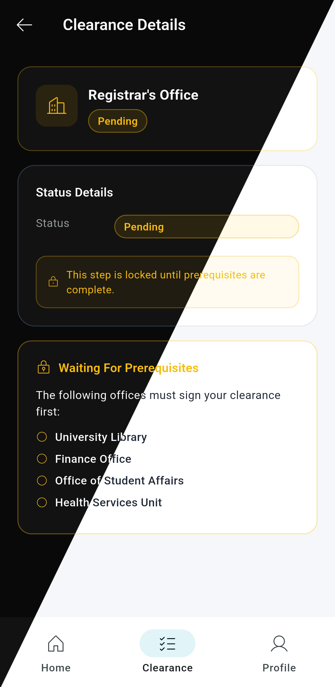
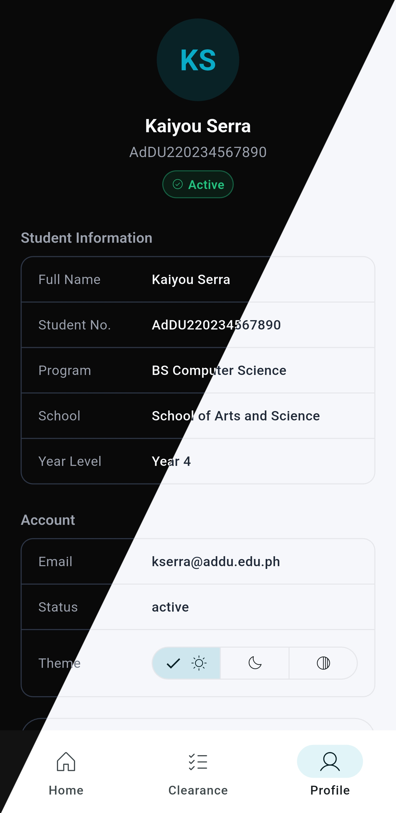
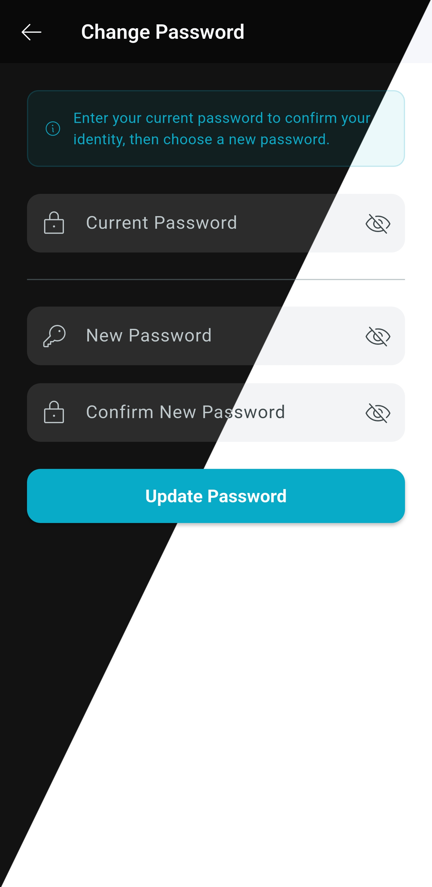

# GradPass - Student Clearance Tracker

GradPass is a role-based digital clearance platform for graduating students.

## Project Overview

Problem:
Graduating students spend weeks chasing document signatories across departments for clearance, with no visibility on which signatures are pending.

This project replaces that manual process with a centralized, trackable workflow where each participant can see and act on the same clearance state.

- Student-facing app/web: view progress, blocked steps, and real-time updates.
- Staff-facing web: review assigned office steps and sign or flag requirements.
- Admin-facing web: manage users, offices, academic periods, prerequisites, requirements, and clearance generation.

The codebase is a single Flutter project that serves multiple platforms (Android and Web) and multiple role-specific experiences.

## Architecture

This project follows an MVVM architecture.

- Model: domain entities under `lib/core/models` (students, offices, periods, steps, profiles).
- View: UI screens/widgets under `lib/features/**/view`.
- ViewModel: state and presentation logic under `lib/features/**/viewmodel`.
- Repository layer: data access under `lib/core/repositories` and feature data repositories.
- Service layer: shared auth/business services under `lib/core/services`.
- Routing and access control: role-aware route guards in `lib/router`.

## Role-Based Experience

- Admin routes (`/admin/*`):
	- Dashboard analytics
	- Offices, schools, programs, periods, staff, students
	- Office prerequisites and requirements configuration
	- Clearance overview, generation, and override controls

- Staff routes (`/staff/*`):
	- Office-scoped clearance queue
	- Prerequisite-aware sign/flag actions

- Student routes (`/student/*`):
	- Home progress summary
	- Detailed clearance timeline
	- Profile and onboarding flow
	- In-app real-time status notifications

## Backend and Data

The app uses Supabase for backend services:

- Postgres tables and views for core entities and clearance status.
- Row Level Security (RLS) policies for role-based access control.
- SQL functions/RPC for operational logic, including:
	- `can_office_sign`
	- `get_dashboard_stats`
	- `generate_clearance_for_student`
	- `generate_clearance_for_all_students`
- Edge Functions for account lifecycle flows:
	- `create_student`
	- `create_staff`
	- `complete_student_onboarding`
	- `delete_user`

## Tech Stack

- Flutter (multi-platform UI)
- Provider (state management)
- GoRouter (navigation)
- Supabase Flutter SDK
- Google Sign-In (student onboarding/login path)

## Screenshots and Media
### Mobile Screenshot Gallery (Light/Dark)

<table>
	<tr>
		<td></td>
		<td></td>
	</tr>
	<tr>
		<td></td>
		<td></td>
	</tr>
	<tr>
		<td></td>
		<td></td>
	</tr>
	<tr>
		<td></td>
		<td></td>
	</tr>
</table>

These screenshots show the full student mobile journey: authentication, onboarding, account setup, progress overview, step-by-step clearance tracking, and profile management.

## Getting Started

### 1. Install dependencies

```bash
flutter pub get
```

### 2. Configure environment values

This app reads config from Dart defines. Use:

- `lib/core/constants/example.config.json` as your template
- `lib/core/constants/config.json` for local runtime values

Required keys:

- `SUPABASE_URL`
- `SUPABASE_KEY`
- `GOOGLE_CLIENT_ID`
- `ALLOW_NON_EDU_EMAILS`

### 3. Run the app

```bash
flutter run --dart-define-from-file=lib/core/constants/config.json
```

Web:

```bash
flutter run -d chrome --dart-define-from-file=lib/core/constants/config.json
```

## Supabase Folder

- `supabase/migrations`: schema, RLS policies, and SQL functions.
- `supabase/functions`: Edge Functions used by admin and onboarding flows.

## Room for Improvement

- Add screenshot sets for staff and admin experiences to complement the student mobile gallery.
- Improve accessibility pass for mobile screens (contrast, labels, and touch target sizing).
- Standardize the structure of screens to ensure architectural consistency.
- Refactor the codebase to replace hardcoded numbers with references from the dedicated constants class.
- Expand automated testing coverage to include unit tests for logic and end-to-end integration tests.
- Develop a unified loading and error-handling UI pattern for all data-driven screens.
